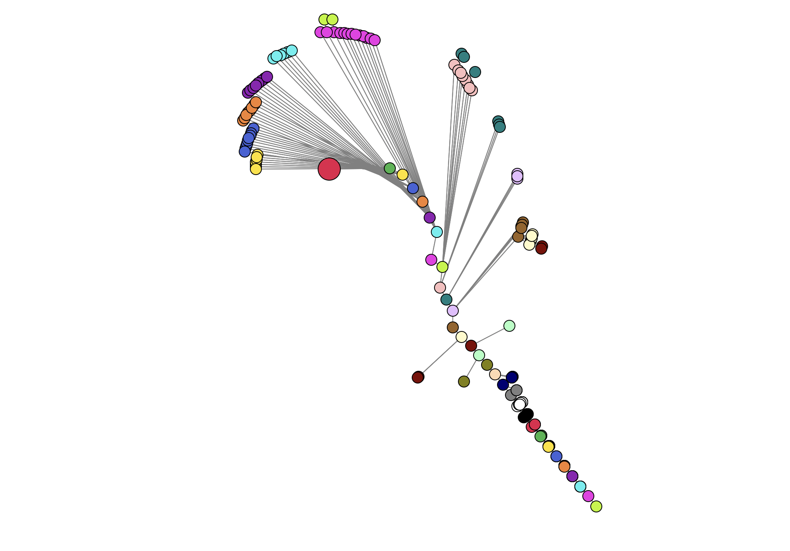
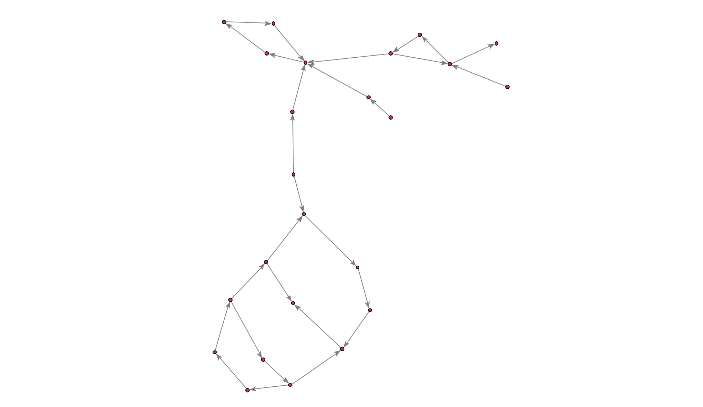
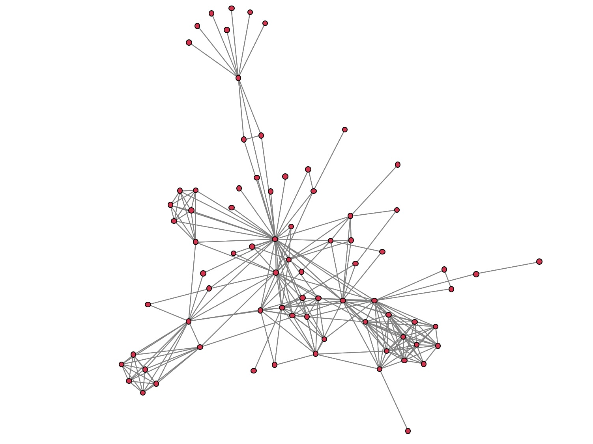
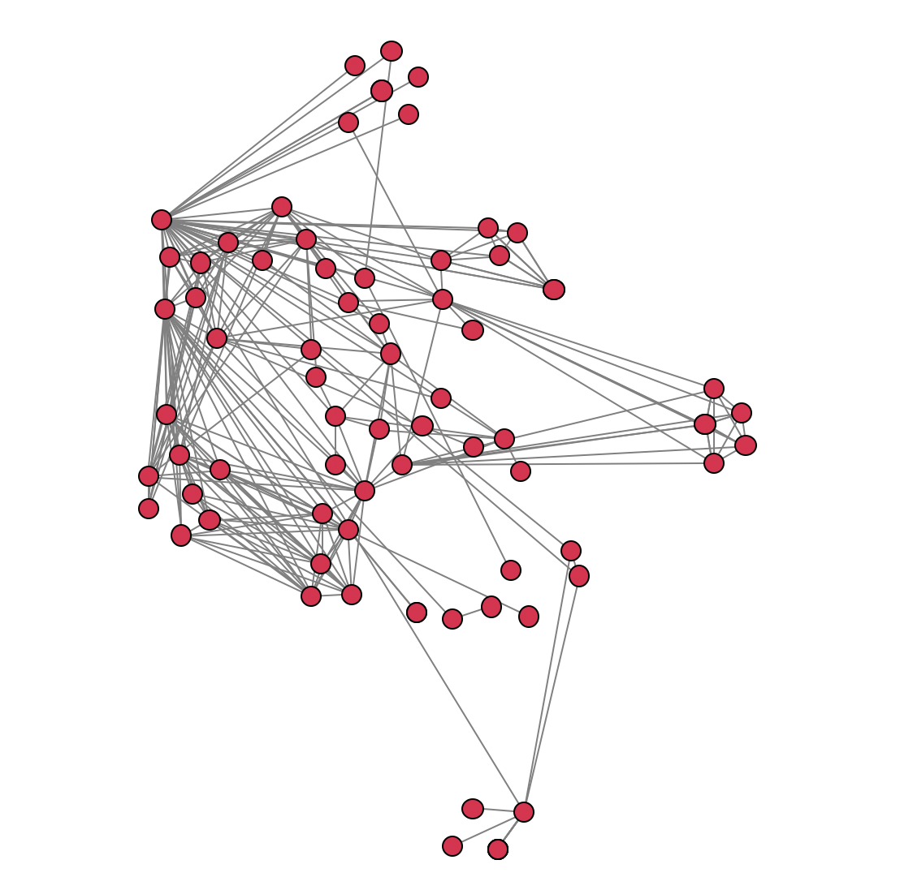

# data-visualization-python

A Python project for visualizing and exploring graph/network data (force-directed layouts, edge bundling, radial/tree views, etc.). The repository contains parsers, layout algorithms, and drawing helpers that operate on .dot graph files.


## Quick start

1. Create and activate a virtual environment (recommended):

```shell
python -m venv .venv
.\\.venv\\Scripts\\Activate.ps1
```

2. Install dependencies

```shell
pip install pipenv
pipenv install --dev
```

3. Run the project

```shell
python Main.py
```

4. Data

Example graph inputs are in the `data/` folder (`.dot` files). Feel free to add your own if you have any.

**Note:** Some combination of visual option might break the code. The attached pdf document offers some guidance and interesting graph images.

## Examples





